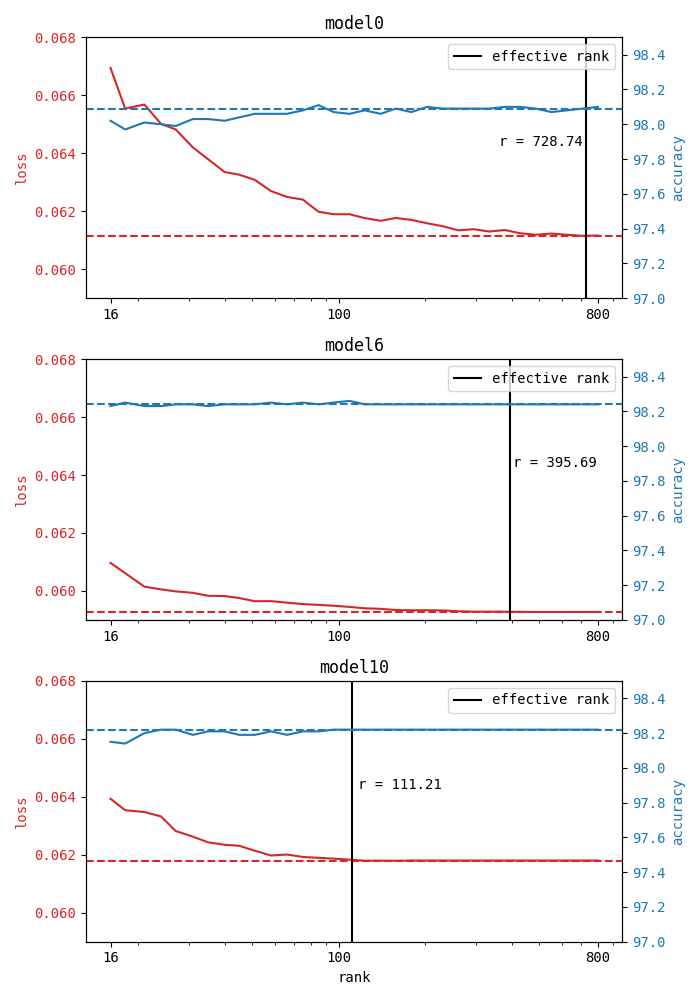

In this note we first train a simple feed-forward neural net on
MNIST, and then investigate compression of the learnt weights
using techniques presented in the paper:
Additionally, we pose the question of whether training with L1 or L2 
penalties will improve the compression rates,
and we try to find empirical relations to a notion of effective rank 
of the the weight matrix.

The complete code is available at 
<https://github.com/lcwell/compressing-weights-with-randomness>.

## Step 1: Data, architecture and training

All models follow a simple baseline skeleton with variations.
It is defined in the class `MnistFCNet` in [mystuff.py](https://github.com/lcwell/compressing-weights-with-randomness/blob/main/mystuff.py).
Here is a brief summary.

---

**Data**: 
As already mentioned, we train on the MNIST dataset. 
The grayscale images are transformed to flat vectors of dimension 784 and 
normalized so that each pixel is in the range $[0,1]$.
Moreover, we have applied the transformation $x \gets (x - \mu) / \sigma$
with values $\mu = 0.1307$ and $\sigma = 0.3881$.
These constants have been used for the 
[MNIST example](https://github.com/pytorch/examples/tree/main/mnist)
of the official PyTorch GitHub repository, and seem to slightly speed up the training.

**Architecture**:
The model follows a simple feed-forward architecture.
In PyTorch-like jargon:
```
MnistFCNet(
  (flatten):     Flatten(start_dim=1, end_dim=-1)
  (layer1):      Linear(in_features=784, out_features=1000, bias=True)
  (activation1): ReLU()
  (dropout1):    Dropout(p=0.5, inplace=False)
  (layer2):      Linear(in_features=1000, out_features=1000, bias=True)
  (activation2): ReLU()
  (dropout2):    Dropout(p=0.5, inplace=False)
  (layer3):      Linear(in_features=1000, out_features=10, bias=True)
  (activation3): LogSoftmax(dim=1)
)
```
ReLU activations are a solid default choice, and
the dropout layers have been added in order to avoid overfitting.
The baseline model uses a dropout probability of 0.5.

**Loss**:
We simply use negative log likelihood (NLL).
Note that this setup, i.e. NLL with the log softmax activation of output layer, 
is equivalent to normal softmax with cross-entropy loss, 
but is usually superior due to more favorable optimization bias and better
numerical stability.

**Optimization**:
We only use Adam here.
The baseline learning rate is 0.001, which is multiplied by 
a default factor of $\gamma = 0.7$ each epoch (see [PyTorch: StepLR](https://pytorch.org/docs/stable/generated/torch.optim.lr_scheduler.StepLR.html)).
The weights will be penalized by their L1 or L2 norm, but 
not for the baseline model.
The default batch size is 64.
Generally, models are trained for 5-20 epochs. The baseline was trained for 5.

---

Now, the target of our investigation is the 1000-by-1000 
weight matrix $W$ of the second layer.
With compression in mind, we hypothesize that a suitable notion of 
*effective rank* will be highly useful to monitor during training.
We chose the one introduced in

> Roy, O., & Vetterli, M. (2007, September). The effective rank: A measure of effective dimensionality. In 2007 15th European signal processing conference (pp. 606-610). IEEE.

It is defined as follows: 
let $s_i$ be the sequence of singular values
of $W$. 
We normalize them via $s_i \gets s_i / \sum_j s_j$, 
which allows us to interpret them as a probability 
distribution.
Then, the effective rank of $W$ is defined as the 
exponential of the Shannon entropy
$$
  \operatorname{rk}_{\textrm{eff}}(W) 
    = \exp\left( \sum_i s_i \log(s_i) \right)
$$
with the convention $0 \log(0) = 0$.
This has a straightforward interpretation and 
good properties.

In the end, three models have been chosen for further investigation
(see 
[notebook outputs](https://github.com/lcwell/compressing-weights-with-randomness/blob/main/models.ipynb)
for full detail of the parameters).
In the table below both loss and accuracy refer to the score
on the test set.

| Model ID | Description | Loss | Accuracy | $\operatorname{rk}_\textrm{eff}(W)$ |
|-|-|-|-|-|
| `model0` | baseline | 0.0613 | 98.09% | 728.74 |
| `model6` | L2 penalty, smaller batch size, higher learning rate, 20 epochs | 0.0593 | 98.24% | 395.69 |
| `model10` | L1 penalty, less dropout, higher $\gamma$, 20 epochs | 0.0618 | 98.22% | 111.21 |

In `model6` we follow the theoretical approach of the recent paper

> Galanti, T., Siegel, Z. S., Gupte, A., & Poggio, T. (2022). SGD and weight decay provably induce a low-rank bias in neural networks. [arXiv:2206.05794](https://arxiv.org/abs/2206.05794).

It makes use of an L2 penalty on the weights (aka *weight decay*) and the results seem to 
verify the claims of the paper in this case, since the effective rank is considerably lower
than that of the baseline.
On the other hand, with `model10` we successfully attempt to induce sparsity on the weights
via an L1 penalty. This reduces the effective rank by a factor of 7 w.r.t. the baseline.

Some further observations during the training:

- SGD (also as predicted in the paper) reduces the effective rank 
  on its own. 
  Indeed, checking the [notebook outputs](https://github.com/lcwell/compressing-weights-with-randomness/blob/main/models.ipynb)
  reveals that this happens in every single training epoch.
- Lower dropout probabilities strengthen the decline of the rank per epoch, 
  higher dropout weakens it.

## Step 2: Naive compression using SVD

Now, we employ the singular value decomposition (SVD) in order to 
produce a low-rank factorization of $W$.
Quick reminder and notation:
Any real matrix $W$ can be decomposed as the product 
$$
  W = A S B^T,
$$
where $A$ and $B$ are both orthonormal and $S$ is a diagonal
matrix with entries $s_i$.
These values are non-negative and are called the singular values of $W$.
By convention, we sort them as
$$ s_1 \geq s_2 \geq s_3 \geq \dots $$
In the code (see [notebook](https://github.com/lcwell/compressing-weights-with-randomness/blob/main/svd_compression.ipynb)) we wrote 
$U \gets A S$ and $V \gets B^T$, resulting in a decomposition $W = UV$.

The SVD is a useful tool for producing an approximation of $W$
of algebraic rank $\leq r$ for some $r$.
Denote by $U_r$ the 1000-by-$r$ matrix obtained by removing the last
$1000 - r$ columns from $U$, and by $V_r$ the $r$-by-1000
matrix obtained by removing the respective rows from $V$.
Since the removed rows and columns correspond to the least significant
singular values, we obtain a low-rank approximation
$W_r = U_r V_r$ of $W$.

Note that the compression factor here is linear in $r$.
Instead of storing $1000 \times 1000$ values we only store
$2 \times 1000 \times r$.
The compression only effectively reduces the number of stored values
if $r < 500$.

In the following figure we plot accuracy and loss on the
test set against the compression rank $r$ for all of the three models.
The dotted red line indicates the original test loss of a given model, 
and the dotted blue line shows the original accuracy.
The black vertical lines show the effective rank of the original 
weight matrix.
All axes have the same scales to ease comparison.



Observations:

- The effective rank is a quite pessimistic estimate for the minimal compression rank in this case.
- All models allow for strong compression: even when the loss increases they maintain a stable level of accuracy (which can be attributed to the nature of classification problems; a regression task would probably have suffered more notably).
- Being able to compress down to a rank as low as 16 hints towards strong over-parameterization of the models. It's very likely that dropout layers and the implicit regularization effects of SGD are responsible for preventing the model from overfitting in the first place.
- The best stability is presented in `model6` which uses L2 weight decay. The L1 penalized `model10` seems to stabilize only after the effective rank, and the baseline `model0` shows the least stability under compression, especially in the terms of the loss.
- An interesting idea to investigate would be to *train* the model in such a low-rank configuration: instead of learning a full linear layer $Wx + b$, one could drectly learn $U V x + b$.

## Step 3: Probabilistic compression

Now we investigate a probabilistic method presented in

> Halko, N., Martinsson, P. G., & Tropp, J. A. (2011). Finding structure with randomness: Probabilistic algorithms for constructing approximate matrix decompositions. SIAM review, 53(2), 217-288. [arXiv:0909.4061](https://arxiv.org/abs/0909.4061).

We describe the chosen approach.
First, we attempt to find a 1000-by-$r$ matrix that has 
a range close to that of the weight matrix $W$.
We sample a 1000-by-$r$ matrix $\Omega$
with independent Gaussian entries 
$\Omega_{ij} \sim \mathcal{N}(0, 1)$.
Set $Y \gets W \Omega$, and apply the QR decomposition
$Y = QR$.
Then, $Q$ is an orthonormal 1000-by-$r$ matrix, that
will satisfy
$$
  \| W - Q Q^T W \| < \epsilon
$$
with high probability given a large enough $r$ (cf. paper).
Next, we set $B \gets Q^T W$, which is an $r$-by-1000 matrix.
The big advantage over the non-probabilistic approach from the 
last section is that we can now compute the SVD of the much 
smaller matrix $B = \tilde{U} S V$, greatly reducing 
computational costs.
Then setting $U \gets Q \tilde{U} S$, 
we obtain another low-rank approximation $W \cong U V$.
The algorithm is implemented in 
[this notebook](https://github.com/lcwell/compressing-weights-with-randomness/blob/main/random_compression.ipynb).

As before, we plot accuracy and loss against the rank $r$
with the same conventions as before.
However, due to the randomness, we resample the 
Gaussian matrix 4 times, to assess the effect
on the compression.


Observations:

- The randomness kicks in the most in the low-rank regime and then stabilizes after passing the effective rank.
- In fact, the effective rank seems to be a much better estimate for the random case than before. This might be worth further investigation.
- All models are less compressible with this method than with the deterministic SVD, which, however, is more demanding in terms of computation.
- The baseline `model0` allows for little to no compression without significantly sacrificing performance.
- Both the L2 penalized `model6` and the L1 penalized `model10` allow for much more compression, but `model6` seems to offer more stability. In both the deterministic and the probabilistic method, weight decay seems to behave more nicely with regard to compression, which strengthens the results of Poggio et al.